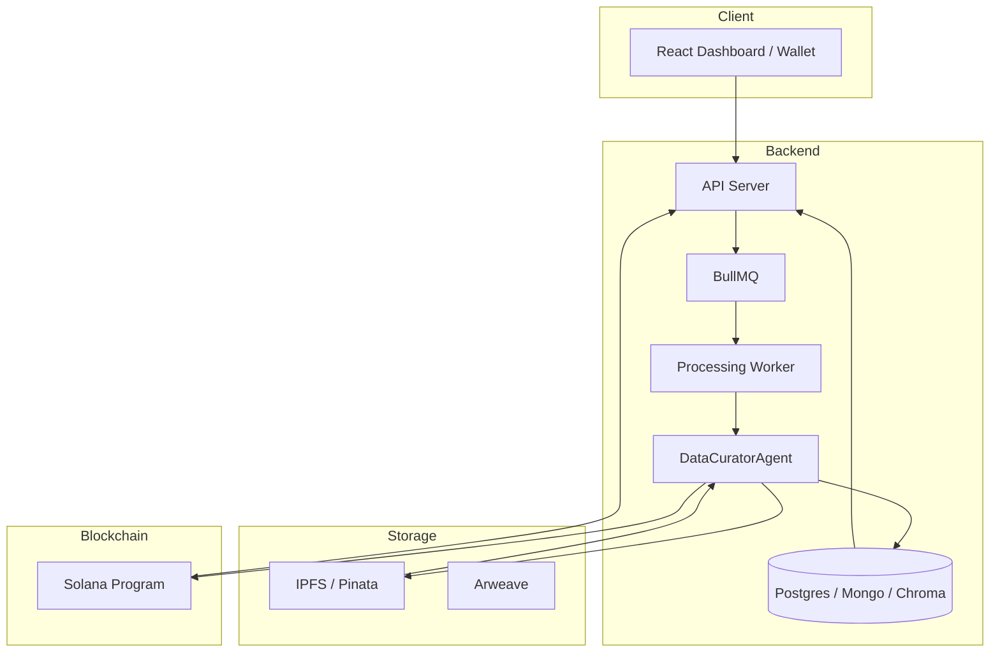
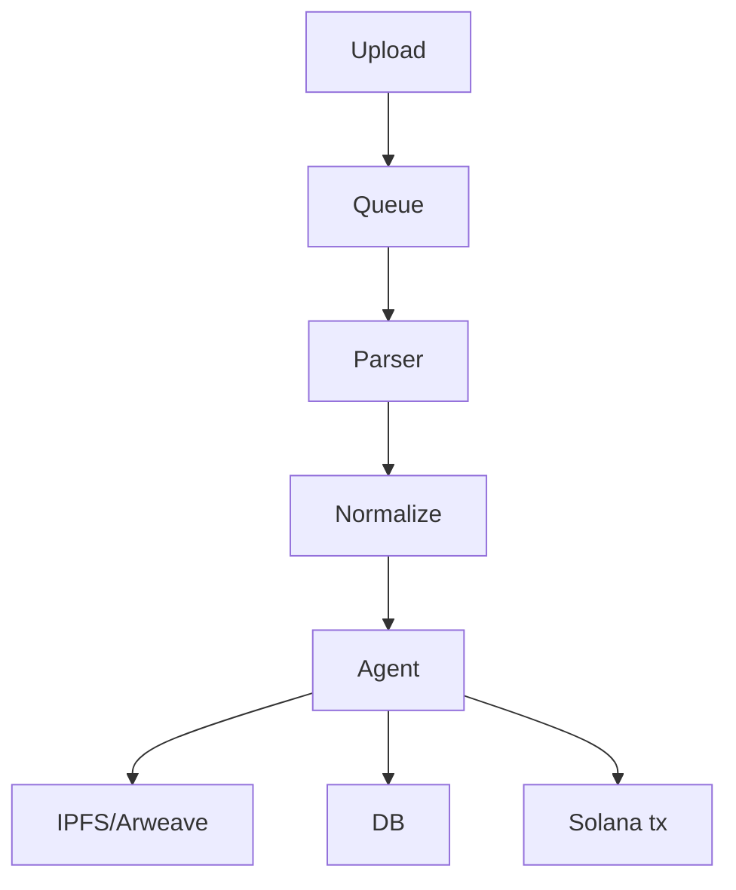

# NeuraViva — Data Management AI Agent

**NeuraViva** is an AI-driven data management platform for molecular docking simulations. It automates ingestion, normalization, AI-driven tagging, analytics, off-chain storage, and on-chain verification on Solana.


**Project:** Data Management AI Agent
**Hackathon:** Zo House (DoraHacks)
**Team:** NeuraViva / lucylow (repo: [https://github.com/lucylow/neuraviva-ai-agent](https://github.com/lucylow/neuraviva-ai-agent))
**Bounty:** NeuraViva — Data Management + Solana verification

**Core goals**:

* Automate processing of docking outputs (Vina, Glide, AutoDock, GROMACS).
* Provide AI-powered classification and natural-language queries.
* Provide immutable verification via Solana + IPFS/Arweave.

Repository layout (high-level)

```
/
├── frontend/           # React dashboard and wallet UI
├── backend/            # API server, ingestion, job queue
├── ai-agent/           # DataCuratorAgent (Eliza-like agent)
├── contracts/          # Solana program (Rust / Anchor)
├── docs/               # Additional docs, diagrams
├── scripts/            # Dev and deployment scripts
└── README.md
```

---

## Quick Links

* Live demo (if deployed): *link placeholder*
* Issues & feature requests: GitHub Issues
* Contact / Maintainers: lucylow (GitHub)

---

## Architecture (Technical)

### High-level diagram (Mermaid)



**Notes**: Agents perform heavy LLM ops and embedding indexing; workers handle CPU-bound parsing.

---

## Data Model

`src/types/index.ts` contains TypeScript definitions for `DockingResult`, `ResearchProject`, `ProteinTarget`, `ProcessingJob`, and more. Key fields:

* `binding.affinity` (float)
* `aiTags.bindingStrength` (strong/moderate/weak/inconclusive)
* `storage.cid` (string), `storage.dataHash` (string), `storage.solanaTx` (string) — critical for verification. 

---

## Core Components — Implementation Notes

### AI Agent (ai-agent/)

* Implements `DataCuratorAgent` with capabilities:

  * `DataQuery`, `DataAnalysis`, `Visualization`, `ReportGeneration`.
* Uses Gemini / OpenAI for classification and natural language reasoning; embeddings stored in Chroma for semantic search. 

**Prompts**: `buildAnalysisPrompt()` constructs the LLM prompt for deep analysis. The prompt includes instructions for summary statistics, binding distribution, protein family patterns, ligand correlations, and anomalies detection. 

### Backend (backend/)

* Express routes:

  * `/data/upload`, `/data/query`, `/data/:id`
  * `/api/agent/chat`
  * Health: `/health`, `/api/agent/status` (see `server` logging in code). 
* Database: Mongoose models for `DockingResult`, `Project`, `User`. 

### Frontend (frontend/)

* Uses TanStack Table for Data Explorer, react-dropzone for upload, @solana/wallet-adapter for wallet interactions. UI contains verification badges and a demo chat. 

### Web3 (frontend/src/web3 & backend/utils)

* `createRegisterInstruction()` builds the Solana `TransactionInstruction` (PDA derivation included). Utility methods format public keys and send transactions reliably (send + confirm). 

---

## Deployment

### Environment variables

Key `.env` variables (see `ai-agent/.env.example` and `backend/.env.example`):

```
GEMINI_API_KEY=
OPENAI_API_KEY=
MONGODB_URI=
REDIS_URL=
SOLANA_RPC_URL=
SOLANA_PROGRAM_ID=
CHROMA_DB_URL=
```

(Examples and full list are in `docs/env.md`). 

### Docker

Each service includes a `Dockerfile`. A `docker-compose.yml` spins up:

* MongoDB, Postgres, Redis, Chroma, Backend, AI Agent, Frontend.

### CI/CD

* GitHub Actions configured for unit tests in `ai-agent` and `frontend`, and Docker image builds.

---

## Running locally (developer)

1. Clone and install dependencies:

```bash
git clone https://github.com/lucylow/neuraviva-ai-agent.git
cd neuraviva-ai-agent
# install deps per subproject
cd backend && npm ci
cd ../frontend && npm ci
cd ../ai-agent && npm ci
```

2. Configure environment variables (`.env`) in root or per service.

3. Start services (dev):

```bash
# Backend
cd backend
npm run dev

# AI Agent
cd ../ai-agent
npm run dev

# Frontend
cd ../frontend
npm run dev
```

See full `docs/developers.md` for advanced debugging and profiling steps.

---

## Core APIs (selected)

### Upload data

```
POST /api/v1/data/upload
Content-Type: multipart/form-data
Body:
  - file: <PDB/MAEGZ/LOG/...>
  - program: "vina" | "glide" | ...
  - projectId: string
  - description: optional
Response: { jobId: string }
```

### Query data

```
POST /api/v1/data/query
Body: { filters: {...}, page: n, limit: m }
Response: { data: DockingResult[], page, limit, total }
```

### Chat with agent

```
POST /api/v1/agent/chat
Body: { message: "find strong kinase inhibitors", userId: "..." }
Response: { response: string, suggestions?, data?: DockingResult[] }
```

---

## Security & Best Practices

* Keep LLM keys secret; rate-limit agent chat to prevent runaway API costs.
* Use signed wallet messages for actions altering on-chain records.
* Use devnet for testing Solana interactions. 

---

## Extensibility

* **New Parsers**: Add `src/agent/tools/FileParser.ts` handlers for new formats.
* **Alternative Blockchains**: Add plugin for Ethereum L2 or other chains — keep footprint minimal.
* **Plugin System**: `agent/plugins/` can add domain-specific validators, automated experimental pipelines, or incentive mechanisms (NFT minting for datasets).

---

## Diagrams & Flowcharts (Operational)

### Ingestion Flow (mermaid)



---

## Appendix: Notable Code Snippets & References

* `ai-agent/src/agent/core/DataCuratorAgent.ts` — agent orchestration. 
* `backend/src/websocket.ts` — socket.io events and agent event wiring. 
* `frontend/src/services/blockchain.ts` — connection & transaction helper examples. 

---

## Licensing & Contribution

* MIT License (see `LICENSE`).
* Contributions are welcome. Please open an issue or PR. Follow the code-style, tests, and security checklist in `CONTRIBUTING.md`.
